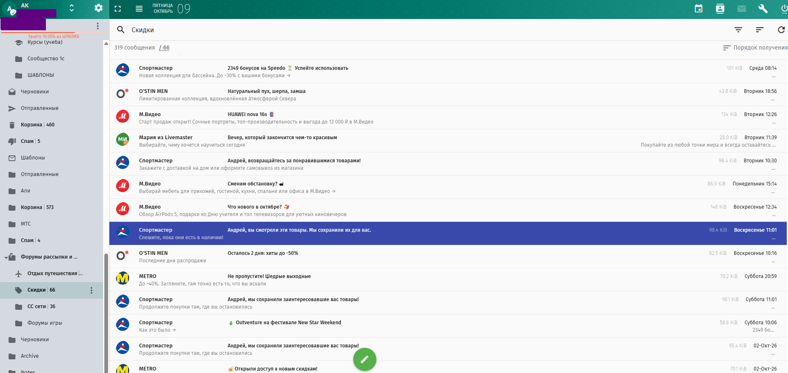
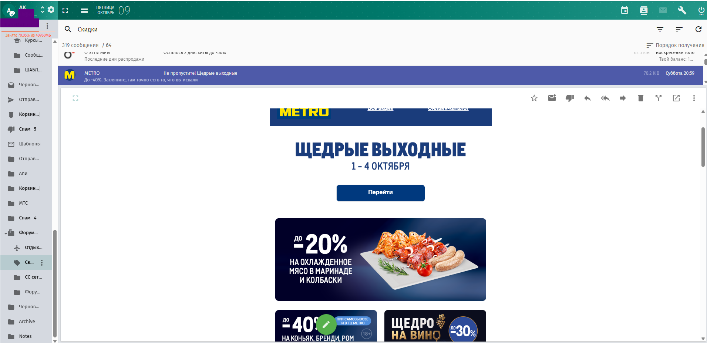
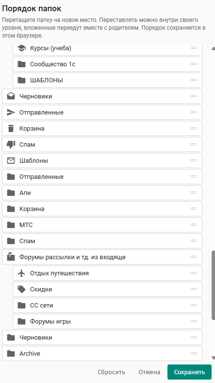

# SOGo webmail extras

A single drop-in `custom-sogo.js` that makes SOGo's webmail (the one shipped
with [mailcow-dockerized](https://github.com/mailcow/mailcow-dockerized)) look
and behave closer to the big mail providers — without patching SOGo itself.

Everything lives in one file that mailcow already bind-mounts, so it survives
`update.sh` and container recreation. No forks, no rebuilt images, no
templates in volumes that get overwritten on restart.

> Tested on mailcow `2026-09a` with SOGo 5.12.11.
> Code comments are in Russian; this README and the install steps are in English.
> A Russian version of this file: [README.ru.md](README.ru.md).

## What it adds

**Sender pictures.** SOGo draws Gravatar monsters or nothing. This replaces the
`Gravatar` service with real company logos (fetched once by a helper script and
embedded as data URIs), Gravatar/Mail.ru photos for real people, and
server-rendered initials with the company logo as a corner badge for employees.
No request leaves the browser while you read mail.

**Folder icons.** Material icons chosen by folder name (receipts, newsletters,
orders, school, taxi, …) instead of 40 identical folder glyphs. Keyword based,
so new folders get an icon automatically.

**Custom folder order.** SOGo sorts folders alphabetically and offers no way to
reorder them. Adds a *Configure order* item to the account menu: a dialog with
the whole tree, drag to reorder, stored per browser.

**Resizable panes.** Drag the edges of the folder pane and the message list;
double-click a splitter to reset. Widths are remembered.

**Reading pane in three positions.** One toolbar button cycles right → bottom →
off. With the pane off, double-click opens a message in its own window (and the
window is sized to your screen instead of SOGo's hardcoded 680×520).

**Message list in one line.** Sender, subject and date on one row, with the
beginning of the message body in grey underneath — like mail.ru. Thin separator
under each row.

**Unread counts everywhere.** SOGo only counts the INBOX and folders you have
opened; this asks the server for all of them, adds a subtree total on collapsed
parents, and shows the count next to the message total — click it to filter to
unread only.

**Encoding repair.** Fixes mojibake from badly built senders: UTF-8 read as
Latin-1 (`архив` → `архив`), windows-1251 text, and subjects where the
sender split a multi-byte character across two RFC 2047 encoded words (SOGo
shows garbage, Mail.ru does not — now neither do we). German and French text is
left alone.

**Toolbar theme.** A gradient band across the top toolbar and the folder pane
header, drawn in CSS with an inline SVG dot pattern — nothing to host.

## Install

```bash
cd /opt/mailcow-dockerized
cp custom-sogo.js data/conf/sogo/custom-sogo.js
docker compose restart sogo-mailcow
```

mailcow already mounts `data/conf/sogo/custom-sogo.js` into the SOGo container
and `sogo.conf` already lists it in `SOGoUIAdditionalJSFiles`, so that is all.

Two SOGo settings are worth adding to `data/conf/sogo/sogo.conf` (restart SOGo
after editing):

```
/* Unread counts for every folder, not just the INBOX and opened ones.
   Must be the number 1 — the client compares strictly. */
SOGoMailFetchAllUnseenCountFolders = 1;
SOGoRefreshViewCheck = every_5_minutes;

/* Seconds before a displayed message is marked read; 0 = instantly, -1 = never. */
SOGoMailAutoMarkAsReadDelay = 5;
```

### Sender pictures (optional)

`sender-logos.py` runs on the mailcow host, reads `From:` headers through
`doveadm`, fetches a logo per domain and a photo per address, shrinks them and
writes them into `custom-sogo.js` between the `SENDER-LOGOS` markers.

```bash
apt install python3-pil fonts-dejavu-core
install -m 755 sender-logos.py /usr/local/sbin/
cp systemd/sender-logos.* /etc/systemd/system/
systemctl enable --now sender-logos.timer
```

Edit the `OWN` tuple at the top of the script to list your own domains. The
script never re-downloads what it already has; failures are retried after
90 days and successful entries refreshed after 90 days.

**Do not commit the generated file.** The embedded block contains the domains
and e-mail addresses of everyone who writes to you.

## Things worth knowing before you hack on this

These cost us a day; they are all written down in the code comments too.

- **`md-button`, `md-subheader` and friends are directives with
  `replace: true`.** In the rendered page they are `<button>` and
  `<div class="md-subheader">`; a selector by tag name matches nothing.
- **`$compileProvider.debugInfoEnabled(false)`** is set, so
  `angular.element(el).scope()` returns nothing. `.controller('sgMessageListItem')`
  still works and gives you the message object.
- **The message list is a `md-virtual-repeat` with `md-item-size="56"`** and the
  folder list with `40`. If your CSS makes a row shorter, the list leaves a gap
  at the bottom; it is not a redraw bug.
- **Collapsing panes is done in viewport units** — `margin-right: -20vw` for the
  sidenav, `-37.5vw` for the list. Narrow a pane and the whole layout slides
  left. This file overrides both with the measured width.
- **`window.opener` is not a popup test.** A normal tab opened from another tab
  has it too. Detect the message popup by `UIxMailPopupView` in the path.
- **Fetching `viewplain` marks the message read** — IMAP sets `\Seen` when the
  body is read. The preview therefore restores the unread flag with
  `markMessageUnread` right after. There is a sub-second window where the
  message counts as read, and if that second request is lost, it stays read.
- **The browser is served a copy** of `custom-sogo.js` from the
  `sogo-web-vol-1` volume, made when the container starts. Editing the source
  without copying looks like "my code does nothing".

## Screenshots



One-line rows with the body preview in grey, folder icons picked by name,
unread counts on every folder, and the total next to the message count
(`319 messages / 66` — click the second number to filter to unread).



The same toolbar button cycles the reading pane: right → bottom → off. The
splitter between the list and the message follows the position — vertical on
the right, horizontal at the bottom — and the size is remembered separately
for each.



*Configure order* from the account menu. Drag within one level — nested
folders travel with their parent. Reset puts everything back to alphabetical.

## License

MIT — see [LICENSE](LICENSE).
